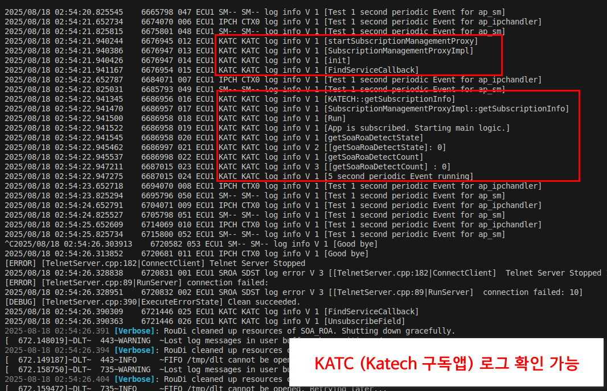

# SDV_example
SDV 구독앱 개발에 필요한 ARXML 및 레퍼런스 코드

### 필수 요구 사항
---
- **Linux/Ubuntu** 환경 (v. 22.04~)
- **Docker**
- **popcornsar PACON-IDE 최신 버전 (v 1.2.16)**

### 도커 빌드 환경 구축
---
**In git root folder**

`./popcorn.sh`

### Build Application
---
#### 1. 도커접속

`ssh popcornsar@localhost -p 41004`

password: 0 or edu!@#$(따로 도커 환경을 실행했을 시)

`docker exec -it edu_1.2.16 bash`

#### 2. 환경변수 설정

`source ~/sdv/SOURCE_THIS`

#### 3. 폴더 구조

sdv/src/eevp_main_machine/  
├── ap_app/ # 타세부 앱 모음  
├── subscription_app/ # 3세부 구독 서비스 앱 모음  
└── adaptive_autosar/ # Adaptive Autosar (arxml, gen_ara) 모음  

#### 4. 빌드 전 구독 앱 심볼릭링크 생성

각 어플리케이션 폴더에 adaptive_autosar폴더로 이어지는 심볼릭링크를 생성한다.

도커 환경에서

<u>**option 1. 직접 생성 방법**</u>

도커 환경에서 각 앱의 폴더에 들어가서 심볼릭링크 생성

ln -s ../../adaptive_autosar adaptive_autosar 명령어 사용  

예)  
cd ~/sdv/src/eevp_main_machine/ap_app/ap_sm  
ln -s ../../adaptive_autosar adaptive_autosar  

<u>**option 2. 간편 생성 방법**</u>

**eevp_main_machine 폴더 내**

`./sub_symbollink.sh
`
#### 5. 어플리케이션 빌드

5.1. 빌드 전 ARXML 설계

adaptive_autosar/arxml/eevp_reflect 이하 폴더들을 AutoSAR.io 프로젝트에 복사 후 작업  
앱 추가 시, adaptive_autosar/arxml/default_template에 있는 Template 파일을 복사 후 원하는 앱 이름으로 변경하여 추가  
ARXML 설계 완료 후 autoSAR.io 프로젝트의 gen_ara폴더를 eevp_main_machine/adaptive_autosar/gen/ 경로로 복사 (최신화)  

5.2.  빌드

<u>**option 1. 직접 빌드 방법**</u>

i) ap_sm 과 ap_ipchandler 는 필수적으로 빌드
(최초 빌드할 시에는 -c -p 옵션 필수 (-c는 초기화, -p는 바이너리 폴더 생성))

`bash ~/sdv/src/eevp_main_machine/ap_app/ap_sm/docker_build.sh -c -p`

`bash ~/sdv/src/eevp_main_machine/ap_app/ap_ipchandler/docker_build.sh`

ii) 구독앱 빌드 예) ap_intelligent_wiper 구독앱 빌드시

`bash ~/sdv/src/eevp_main_machine/subscription_app/ap_intelligent_wiper/docker_build.sh`

<u>**option 2. 간편 빌드 방법**</u>

`cd ~/sdv/src/eevp_main_machine/  `

build_template.sh를 build.sh로 복사 후  
build.sh 에서 빌드하고자 하는 modules 입력 및 주석 처리하여 사용  
(build_template.sh 수정 X)  

`./build.sh`

#### 6. 어플리케이션 실행

`cd $PARA_CORE/bin`

`./EM`

(~/sdv/에 test.sh 스크립트로 존재)

 

### 개발시 참고 및 유의사항  
---
#### 1. arxml 설계는 비디오 참고
https://drive.google.com/file/d/12CyRW6FuNO60p7GWbb7CrmrkrDJxB2Ml/view

#### 2. ap_katech 레퍼런스 코드
ap_katech 은 개발 및 제어기 구동 검증이 완료된 서비스입니다. ap_katech 은 roa 센서값에 따라 rear curtain 을 제어하며 ap_roa, ap_rearcurtain, ap_subscriptionmanager 서비스를 사용합니다. 해당 앱의 arxml 과 소스코드를 레퍼런스 삼아 개발하시면 편리합니다.

#### 3.  ap_subscriptionmanager 인터페이스 추가 필요
모든 구독앱은 해당 인터페이스를 통해 구독상태 (enable/disable) 상태를 가져와야 합니다.
코드 구현은 ap_katech 의 소스코드 부분을 참고하시고
arxml 설계는 pdf 파일을 참고하시기 바랍니다:
[사용자 매뉴얼 (PDF)](/readme_file/Eevp.Subscription.Service-v21-20250818_125207.pdf)

#### 4.  구독앱 별 SOME/IP Client ID 및 port 정보 
- 서비스 인터페이스별로 유니크한 port 번호와 client ID (proxy 기준) 가 지정되어야 합니다.
- 아래 테이블같이 기관별로 port 100개씩 배분합니다.

| 기관| Port 번호 사용 범위|
| --- | --- | 
| 한자연 | 40000 ~ 40099 |
| 롯데이노베이트|  40100 ~ 40199 | 
| 티스마트 | 40200 ~ 40299 |
| 국민대| 40300 ~ 40399  |
| 한국공학대| 40400 ~ 40499  |

- VC Main 3세부 구독앱에 배분된 ID : 0x351 ~ 0x370 ❗❗(25.08.20) client ID 관련해 총괄과 개수 확인중❗❗
- 다른 SW와 겹치지 않도록 <u>**아래 테이블 업데이트**</u>🙌 부탁드립니다.
  
| Application Name| Client ID| 사용 interface| TCP UDP port | 담당기관 |
| --- | --- | --- | --- | --- |
| KATECH (ROA-RearCurtain 데모앱)| 0x351 | Eevp.Control.SoaRoa| 40000| 한자연 |
| KATECH (ROA-RearCurtain 데모앱) | 0x352| Eevp.Control.SoaRcurtain| 40001| 한자연|
| KATECH (ROA-RearCurtain 데모앱) | 0x353| Eevp.Subscription.Service| 40002|한자연 |
| IntelligentWiper (한자연 구독앱) | 0x354| Eevp.Control.SoaVehicleInfo| 40010|한자연 |
| IntelligentWiper (한자연 구독앱) | 0x355| Eevp.Control.SoaWiper| 40011|한자연 |
| ServiceCreator (시뮬레이션 통신앱) | (Provider) | Eevp.Simulation | 40050 ~ 40070 |한자연 |
| BatteryMonitor (티스마트 앱A) | 0x356 | BmsInfoSrv | 40200 ~ 40299 |티스마트 |
| BatteryMonitor (티스마트 앱A) | 0x357 | Eevp.Control.SoaMlm | 40200 ~ 40299 |티스마트 |
| BatteryMonitor (티스마트 앱A) | 0x358 | Eevp.Subscription.Service | 40200 ~ 40299 |티스마트 |
| SmokingMonitor (티스마트 앱B) | 0x359 | Eevp.Control.SoaDms | 40200 ~ 40299 |티스마트 |
| SmokingMonitor (티스마트 앱B) | 0x35A | Eevp.Control.SoaMlm | 40200 ~ 40299 |티스마트 |
| SmokingMonitor (티스마트 앱B) | 0x35B | Eevp.Control.SoaHvac | 40200 ~ 40299 |티스마트 |
| SmokingMonitor (티스마트 앱B) | 0x35C | Eevp.Control.SoaSmartFilm | 40200 ~ 40299 |티스마트 |
| SmokingMonitor (티스마트 앱B) | 0x35D | Eevp.Subscription.Service | 40200 ~ 40299 |티스마트 |
| RestingEnv (티스마트 앱C) | 0x35E | Eevp.Control.SoaVehicleInfo | 40200 ~ 40299 |티스마트 |
| RestingEnv (티스마트 앱C) | 0x35F | Eevp.Control.SoaDriverSeat | 40200 ~ 40299 |티스마트 |
| RestingEnv (티스마트 앱C) | 0x360 | Eevp.Control.SoaMlm | 40200 ~ 40299 |티스마트 |
| RestingEnv (티스마트 앱C) | 0x361 | Eevp.Control.SoaRcurtain | 40200 ~ 40299 |티스마트 |
| RestingEnv (티스마트 앱C) | 0x362 | Eevp.Control.SoaSmartFilm | 40200 ~ 40299 |티스마트 |
| RestingEnv (티스마트 앱C) | 0x363 | Eevp.Subscription.Service | 40200 ~ 40299 |티스마트 |
| IntelligentWiper (한자연 구독앱) | 0x364| Eevp.Subscription.Service | 40012 |한자연 |
| LITSmartFilm (롯데이노베이트 앱C) | 0x365 | Eevp.Control.Service | 40100 ~ 40199 |롯데이노베이트 |
| LITSmartFilm (롯데이노베이트 앱C) | 0x366 | Eevp.Control.Service | 40100 ~ 40199 |롯데이노베이트 |
| LITSmartFilm (롯데이노베이트 앱C) | 0x367 | Eevp.Subscription.Service | 40100 ~ 40199 |롯데이노베이트 |
| PreventRollback (국민대학교 앱) | 0x368 | Eevp.Pdw.Service | 40301 | 국민대학교 |
| PreventRollback (국민대학교 앱) | 0x369 | Eevp.Simulation.BCM_ExteriorSignal | 40302 | 국민대학교 |
| PreventRollback (국민대학교 앱) | 0x36A | Eevp.Subscription.Service | 40303 | 국민대학교 |
| PreventRollback (국민대학교 앱) | 0x36B | Eevp.Control.SoaVehicleInfo | 40304 | 국민대학교 |
| PreventRollback (국민대학교 앱) | 0x36C | Eevp.Simulation.VCS_BrakePedal | 40305 | 국민대학교 |
| PreventRollback (국민대학교 앱) | 0x36D | Eevp.Simulation.VCS_AccrPedal | 40306 | 국민대학교 |
| PreventRollback (국민대학교 앱) | 0x36E | Eevp.Simulation.VCS_Gear | 40307 | 국민대학교 |
|1|2|3|4|5\

#### 5.  구독SW FunctionGroup 설정 필요 
- FG 은 구독앱 설치/삭제/업데이트 시 SW 프로세스 실행/종료를 위함
- Adaptive AUTOSAR Flatform에서는 FunctionGroup에 지정된 프로세스들이 함께 실행/종료됩니다
- 상호 의존성을 줄이고자 FunctionGroup을 사전에 미리 지정(SFG01~SFG20)해두었으니 ARXML 설계 시 포함만 해주시면 됩니다
- 다른 SW와 FunctionGroup이 겹치지 않도록 <u>**아래 테이블 업데이트**</u>🙌 부탁드립니다.

| FG| 구독앱| 담당기관|
| --- | --- | --- |
| SFG01| KATECH  (roa-리어커튼) | 한자연 |
| SFG02 | IntelligentWiper | 한자연 |
| SFG03 | ServiceCreator | 한자연 |
| SFG04 | BatteryMonitor | 티스마트 |
| SFG05 | SmokingMonitor | 티스마트 |
| SFG06 | RestingEnv | 티스마트 |
| SFG07 | PreventRollback | 국민대학교 |
| SFG08 | LITSmartFilm| 롯데이노베이트|
| SFG09 | | |
| SFG10 | | |

#### 6. 작업 브랜치
/dev/(구독앱) branch에서 작업 부탁드립니다.

#### 7. Pull Request
도커 환경에서 구독앱 구동 테스트까지 완료 후 <u>**main 브랜치로 PR**</u>🙋‍♀️ 보내주세요.

- 도커 환경에서는 아래와 같이 log 확인이 가능합니다
- 예시) ap_katech 빌드후 ./EM 실행시 아래와 같은 로그 출력
  
#### 8. 10종 제어기 IF 파일 

| 10종 제어기| 파일| 기타|
| --- | --- | --- |
| 1. 스마트필름| [인터페이스 (PDF)](/readme_file/01_Eevp.Control.SoaSmartFilm-v2-20250715_183413.pdf)| |
| 2. 공조|  [인터페이스 (PDF)](/readme_file/02_Eevp.Control.SoaHvac-v5-20250715_183205.pdf)| |
| 3. ROA|  [인터페이스 (PDF)](/readme_file/03_Eevp.Control.SoaRoa-v9-20250715_183406.pdf)| |
| 4. DMS|  [인터페이스 (PDF)](/readme_file/04_Eevp.Control.SoaDms-v2-20250715_183221.pdf)| |
| 5. 무드램프| [인터페이스 (PDF)](/readme_file/05_Eevp.Control.SoaMlm-v11-20250715_183326.pdf)| |
| 6. 와이퍼| [인터페이스 (PDF)](/readme_file/06_Eevp.Control.SoaWiper-v8-20250715_183430.pdf)| |
| 7. 시트| [인터페이스 (PDF)](/readme_file/07_Eevp.Control.SoaDriverSeat-v9-20250715_183243.pdf)| |
| 8. 리어커튼| [인터페이스 (PDF)](/readme_file/08_Eevp.Control.SoaRcurtain-v8-20250715_183348.pdf)| |
| 9. 초음파|[인터페이스 (PDF)](/readme_file/09_Eevp.Pdw.Service-v9-20250715_183510.pdf) | |
| <s>10. 전원</s> |<s>[인터페이스 (PDF)](/readme_file/10_Eevp.Control.SoaPower-v10-20250715_183420.pdf) </s> |구독앱에서 실질적으로 사용 어려움 |
| 그외) 차속과 기어 |[인터페이스 (PDF)](/readme_file/Zone1.VehicleInfo.Input-v2-20250715_190033.pdf) |현재(25.08.18) ap_soa 로 VC main 구독앱에 제공 아직 불가능. 추후 가능해지면 관련 코드 업데이트 예정 |
